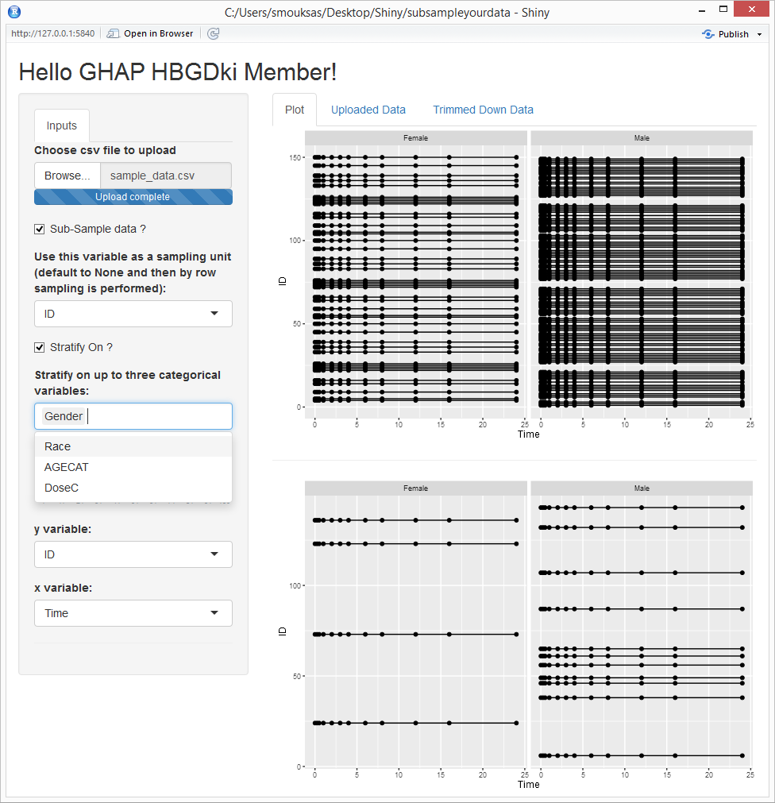

subsampleyourdata
========

R Shiny app to reduce the size of your data respecting one optional grouping ID and up to three optional stratification(s) variables. The default is to keep 10% of the data.
The app copy a set of functions from dpastoor/PKPDmisc to allow users to use the app without the need for admin rights and Rtools.


### CSV Data Input 

* [read.csv("youruploadeddata.csv",na.strings = c("NA","."))]

### Data SubSampling

* [resample_df](https://github.com/smouksassi/PKPDmisc/blob/master/R/resampling_functions.R)


### Running Information
```
shiny::runGitHub('subsampleyourdata', 'smouksassi')

```


